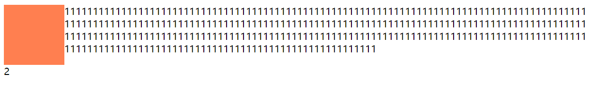

# css 页面布局与网格 , 浮动

## 1.布局的介绍
- 固定布局
- 弹性布局
- 流动布局: 指页面的元素会按照比例缩放但是,元素之间的比率保持不变
  
## 2.创建灵活的页面布局demo
### 1.float布局
- 使用float
- 内部元素使用min-height属性,以免子元素超出父元素,父元素不能撑开
  
### 2.流式空距
- border-box 当设置外边距,所有列的总宽度大于100%就会发生错乱的现象
  ```css
  .col {
        float: left;
        box-sizing: border-box;
        min-height: 100px;
        outline: 1px solid #666;
        /* 布局会乱,因为加上了外边距,所有列的总宽度超过了100% */
        margin: 0 0.9% 1.375em;
      }
  ```
  
**解决办法:**
- 抵消最外侧的空距
  ```css
    .row {
        margin: 0 -0.9%;
      }
  ```
  
  这种方法是依据: 
  没有特定宽度的非浮动块级元素,会在左右负外边距的情况下扩展其宽度
- 设置空距的替代方案:padding
  em单位是相对于文本的大小,放大文本会改变,而百分比与宽度有关
  ```css
   .col {
        float: left;
        box-sizing: border-box;
        min-height: 100px;
        outline: 1px solid #666;
        padding: 0 0.9% 1.375%;
      }
  ```
- 文字过长换行 
  ```css
  .col {
        word-wrap: break-word;
      }
  ```
## 浮动布局缺陷,锯齿效果
- 当一个浮动元素中的列过长时就会出现锯齿,

  flex 布局实现等高,flex:1 ->对多余的或者缩放的空间进行分配


- 用inline-block 代替浮动
  

  ```css
   .row-wrapping {
        font-size: 0;
        margin: 0 -11px;
        margin: 0 -0.6875rem;
      }
      .row-wrapping > * {
        float: none;
        vertical-align: top;
        display: inline-block;
        font-size: 16px;
        font-size: 1rem;
      }
  ```
  
## 浮动
  - 浮动之后的文本会形成环绕,将浮动元素占据得空间留出来.其他除了文本的元素该怎么布局怎么布局,就当浮动元素不存在一样,有的甚至会覆盖.
  
  - 阻止文字环绕的效果,给文字所在的盒子清除浮动
    ```css
    .clear-float {
        clear: both;
      }
    ```
  
  - 父元素高度塌陷-BFC
    ```css
    .row:after {
        content: "";
        display: block;
        clear: both;
      }
    ```
- 网格布局(二维布局:可以跨行)
  

用于表示列宽的单位:fr(fraction of available space)

repeat函数:repeat(5,1fr) -> 1fr 1fr 1fr 1fr 1fr


```css
/* 2行4列,行高300培训,4列等 */
.wrapper{
  display : grid;
  grid-template-rows: 300px 300px;
  grid-template-columns:1fr 1fr 1fr 1fr;
  /* grid-template-columns:repeat(4,1fr); */
}
```

由于网格轨道在DOM中并没有特定的元素表示,所以不能通过max-width或者min-width之类的属性来为它们指定大小,使用minmax()函数->minmax(4em,1fr)

```css
/* 简写:前边士行的定义,后边是列的定义,用'/'隔开 */
.wrapper{
  display : grid;
  grid-template: auto minmax(4em,1fr) minmax(4em,1fr)/repeat(5,1fr);
}
```
----
# 响应式布局

只创建一个能适配多种设备的网站:响应式网站
- 匹配视口:
  ```html
  <meta name="viewport" content= "width=device-width, initial-scale=1">
  ```
  视口宽度基准:device-width 当前设备的理想尺寸

  与理想视口匹配的缩放级别: initial-scale>1 放大布局 

- 媒体查询: 
  可以在link元素中写也可以在css文件中写
  
  在link中:
  ```html
  <link rel="stylesheet" href="main.css" media = "screen and (min-width:600px)">
  ```
  css文件中:
  and关键字负责把媒体类型与我们要测试的条件连接起来,因此可以同时测试多个条件
  only关键字为了防止旧版浏览器错误的应用样式
  ```css
  @media only screen and (min-width:600px) and (max-width:1000px){

  }
  ```

## 响应式布局的设计模式
- 移动优先:先把考虑各种限制因素再扩展
- 响应式文本列:`column-width:16em`
- flex
- grid Layout + 媒体查询
- 图片:1.媒体查询+改变图源 2.分辨率查询切换图片
- 响应式嵌入媒体:
  - 给图片,视频设置max-width:100% 让元素变得可伸缩,同时又不会超过其固有大小
  - srcset 和 size 的配合使用:浏览器的预解析器知道该解析哪一个.
  - 小屏设备加载大的图片时候在放大或者缩小的时候会耗费处理器时间和内存空间
  - picture元素 webp格式
- 视口单位:
  - vh,vw
  - vmin 宽高较小的那个
  - vmax
- 对于em:相对于当前的字体的大小,如果设置了font-size属性,并且单位是em ,那么此时的1em就会在font-size的基础上叠加.

----
# 表单与数据表

## 1. label 与 input 
- checkbox/radio :label的for 要与input的id相同才能有相应的checked等效果
- radio : input 的name属性要相同,控制单选

## 2. 有序列表ol

- 属性start:[number] 设置序号从哪个数字开始

## 3.aria-hidden
- 现代的辅助技术能够识别并朗读由 CSS 生成的内容和特定的 Unicode 字符


# 变换 transform 
- transform 性能好,相应的计算只会影响相关元素的坐标系统,既不会改变元素内部的布局,又不会影响外部其他元素
- 变换不会影响脚本计算或者布局计算,多数浏览器会尽量安排图形处理器来做这些计算

## 1.  transform-origin 
- 该属性允许您改变被转换元素的位置。默认 50% 50% 0 ,也就是以中心为基点
  
## 2. 修改变换
- 如果想要添加其他动态效果,如鼠标悬停动画,声明时把之前的平移的动作全加上

# 动画 transition
  ## 1.transform 和 translate
- transform的中文翻译是变换、变形，是css3的一个属性，和其他width，height属性一样

- translate 是transform的属性值，是指元素进行2D变换，2D变换就是指，元素以当前位置（0,0）按照x轴的方向移动多少，按照y轴的方向移动多少 

例如：

- transform：translate(0,100%) 表示从元素的当前位置延y轴方向，向下移动整个元素高度的距离

- transform：translate(-20px,0) 表示从元素的当前位置延x轴方向，向左移动20px

- transform 有很多其它属性值，translate3D（3D变换）,scale（2D缩放）等其他的变换方式

 

## 2. transition :property duration timing-function delay;

- transition  在一定时间之内，一组css属性变换到另一组属性的动画展示过程。可以用来实现动态效果，css3的属性

- 语法 transition：需要变换的属性 变换需要的时间 控制动画速度变化 延期多少时间后开始执行 

- transition属性写在最初的样式里，而不是放在结束的样式里，即定义动画开始之前的元素外观的样式。只需要给元素设置一次transition，浏览器就会负责以动画展示从一个样式到另一个样式。
  ```css
   .hello {
        width: 200px;
        height: 200px;
        border: 2px solid #ccc;
        background: url(images/step-animation.png) no-repeat 0 -1200px;
        -webkit-transition: background-position 0s 0.3s steps(6, start);
        transition: background-position 0s 0.3s steps(6, start);
      }
      .hello:hover {
        -webkit-transition-delay: 0;
        transition-delay: 0;
        -webkit-transition-duration: 0.6s;
        transition-duration: 0.6s;
        background-position: 0 0;  
      }
  ```
- 有的属性只能数值过度:height等
- 有的属性只接受整数:z-index,columns-count
## 3. 曲线动画
